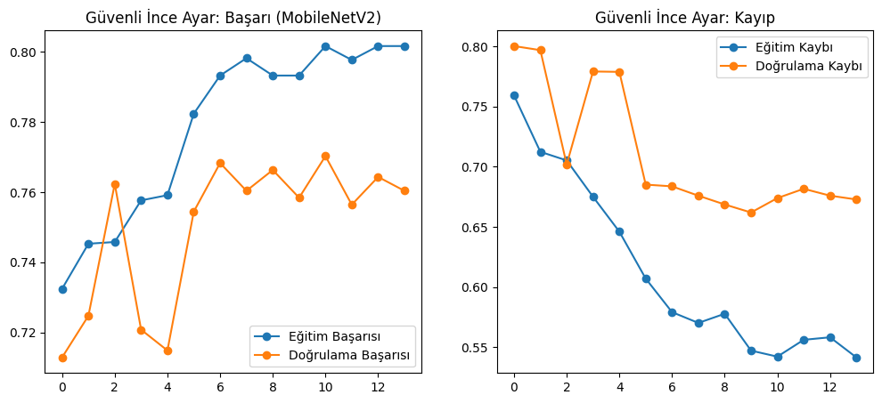
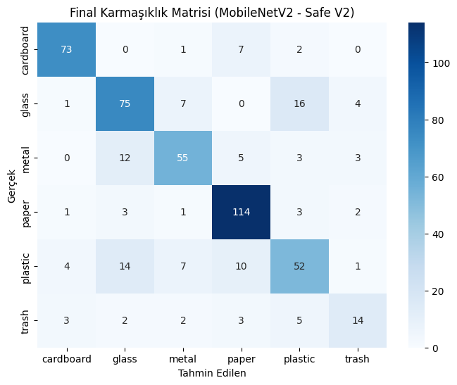
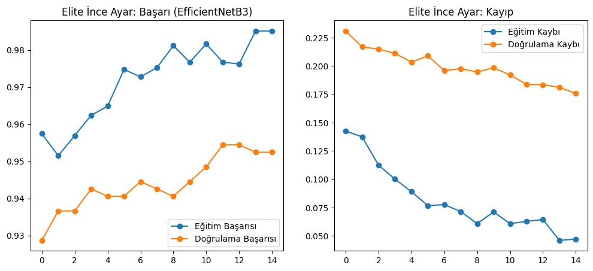
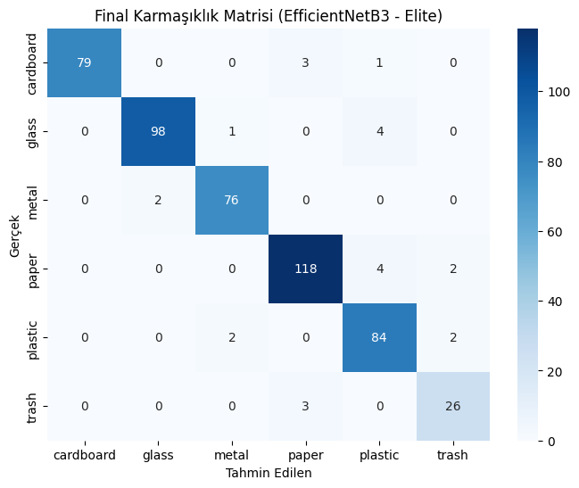

# Derin Öğrenme ile Akıllı Atık Sınıflandırma (Garbage Collection)

Bu proje, çevre kirliliğini azaltmak ve geri dönüşüm süreçlerini otomatikleştirmek amacıyla derin öğrenme modelleri kullanılarak geliştirilmiş bir atık sınıflandırma sistemidir. Proje kapsamında **MobileNetV2** ve **EfficientNet** mimarileri kullanılarak transfer öğrenme (transfer learning) yöntemiyle modeller eğitilmiş ve performans karşılaştırmaları yapılmıştır.

## 📌 Projenin Amacı & Özet
Gelişen dünyada evsel ve endüstriyel atıkların doğru ayrıştırılması, geri dönüşüm verimliliği için kritik bir öneme sahiptir. Bu çalışmada, görüntü işleme ve evrişimli sinir ağları (CNN) kullanılarak katı atıkların otomatik olarak sınıflandırılması hedeflenmiştir. Proje detaylarına, mimari seçimlerine ve analiz sonuçlarına ana dizindeki `Bildiri.pdf` dosyasından ulaşabilirsiniz.

## 👥 Ekip (Contributors)
Bu proje bir takım çalışması olarak başarıyla geliştirilmiştir:
* [Mehmet Yağlı](https://github.com/senin_kullanici_adin)
* [Furkan](https://github.com/furkanin_kullanici_adi)

## 📂 Proje Yapısı
* 📁 **assets/** - Eğitim grafikleri ve karmaşıklık matrisleri
* 📁 **notebooks/** - Colab model eğitim dosyaları (.ipynb)
* 📄 **.gitignore** - Git tarafından yok sayılacak dosyalar yapılandırması
* 📄 **Bildiri.pdf** - Proje raporu ve akademik bildiri dosyası
* 📄 **README.md** - Proje dokümantasyonu

## 📊 Kullanılan Modeller ve Performans Karşılaştırması
Projede iki farklı derin öğrenme mimarisi aynı veri seti üzerinde eğitilmiştir:

| Model Mimarisi | Test Doğruluğu (Accuracy) | Öne Çıkan Özelliği |
| :--- | :---: | :--- |
| **MobileNetV2** | %XX.XX | Hafif parametre yapısı, düşük gecikme süresi (Mobil/Kenar cihazlara uygun) |
| **EfficientNet** | %XX.XX | Optimize edilmiş bileşik ölçeklendirme, daha derin öznitelik çıkarımı |

### 📈 MobileNetV2 Eğitim Performansı
**Eğitim ve Doğrulama Grafikleri:**

**Karmaşıklık Matrisi (Confusion Matrix):**

### 📈 EfficientNet Eğitim Performansı
**Eğitim ve Doğrulama Grafikleri:**

**Karmaşıklık Matrisi (Confusion Matrix):**

## 🛠️ Kullanılan Teknolojiler
* Python 3.x
* Google Colab (GPU Hızlandırıcı)
* TensorFlow / Keras
* Matplotlib & Seaborn
* OpenCV